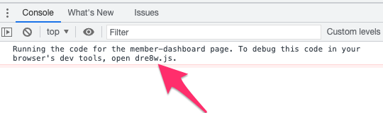

# Velo Workshop
Learn Velo by Wix by building a full stack fully functioning service availability monitoring system.

## Abstract
Not a lot of people know this but with Velo by Wix you can build any (and I mean any) webapp that exists today. You can build your own small version of Facebook/ Gmail / Netflix / etc… Of course the performance, scale & branding won’t be the same. But, in terms of functionality you can do it. In this workshop you will learn about Velo’s spectrum of features that allow anyone to build the webapp for their needs. Features such as exposing REST API /  running cron jobs on the server / building site members private and unique dashboards / sending personalized and parameterized emails and much more. During the workshop we will build a fully functional multi tenant service availability monitoring system (aka a very simple version of [Pingdom](https://www.pingdom.com/)). So join us, fun guaranteed! 

## What are we going to do?
We’ll build a fully functional multi tenant service availability monitoring system (aka a very simple version of [Pingdom](https://www.pingdom.com/)). 

What is service availability monitoring system? It’s a system that monitors the availability of your services and notifies you in real time in case one of your services is down.

## What’s in it for me?
By the end of this workshop you will understand and have experience with the following velo features/ concepts:

* Writing protected pages (visible only to site members)
* Zero code CRUD using data binding
* Rendering repeated items using repeaters
* Wix data hooks
* Wix data events (not to be confused with the wix events vertical)
* Web methods (aka .jsw)
* Expose REST API via velo
* Scheduling jobs (aka setting up cron jobs)
* Keeping secrets in the secret manager
* Triggered emails
* Clean code practices on velo

## Before we start
Before we'll dive into the workshop there are some important things you should know when working w/ Velo.
* Monitoring and Debugging
    * Backend logs can be viewed in the [Site Events (aka logs)](https://manage.wix.com/account/site-selector/?actionUrl=https%3A%2F%2Fmanage.wix.com%2Fdashboard%2F%7BmetaSiteId%7D%2Fsettings%2Fmonitoring%2Fsite-events&title=Site+Events&primaryButtonText=Select) section in the business manager's developer tools menu.
    * Debugging client code can be done via the browser's developer tools. Look in the console for the file name of the page you want to debug

* Preview mode - Some Velo features such as "Events" and "Scheduled jobs" doens't work in preview mode. It's best to publish the site and check on production.

## Let's start

* [Step 1 - Members only protected pages + zero code CRUD](./step1.md)
* [Step 2 - Learning about repeaters](step2.md)
* [Step 3 - validity checks using wix data hooks](step3.md)
* [Step 4 - Creating an API key using events](step4.md)
* [Step 5 - Exposing backend functionality via web methods](step5.md)
* [Step 6  - Monitoring a service and exposing REST API](step6.md)
* [Step 7 - Implementing the core business logic using scheduled jobs + triggered emails](step7.md)
* [Clean code practices, security best practices, uncovered material and further reading](further-reading.md)

