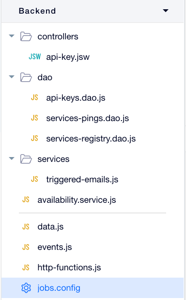

# Clean code practices, security best practices, uncovered material and further reading

## Clean code practices

It's easy to get carried away with Velo's high development velocity and write "quick and dirty" code. But, it's not a must! In the pingdom project I've divided the files, especially backend files into folders and gave it clear names. 

For example:
* DAO (data access object) files were under the "dao" folder
* Client facing APIs were under the "controllers" folder
* Business logic services were under the "services" folder

For client code my tips are:

* Organize your code in short and easy to understand functions
* Write your cross page shared logic in `public.js`
* For complex projects use some kind of state management system such as mobx. Learn more on [using velo with mobx](https://www.youtube.com/watch?v=1tAAErlj9og)
* Bind to events using code (e.g `$w('#myBtn').onClick(handler)`) instead of the properties panel. This make the code easier to reason about. The reader can understand the code just from the code and they won't miss information that is visible outside of the code (i.e properties panel)

## Security best practices

* Always check your tables permissions. Make sure that only the right users have access to the right data in the DB.
* When possible, avoid calls to the database from the client. Instead, expose a web-method which will return the desired data. This way you can set the entire database permissions to "admin only" and use `suppressAuth: true` when accessing it via the backend.
* Use [Velo Secret Manager](https://support.wix.com/en/article/velo-about-the-secrets-manager) to store private keys and other "secrets"
* Make sure to encrypt PII fields in your databases. [Here's how](https://support.wix.com/en/article/storing-personally-identifiable-information-pii-data-using-content-manager)
* Make sure your web-methods has the right permissions. [Here's how](https://support.wix.com/en/article/velo-about-web-module-permissions)

For more security best practices please read our [KB article](https://support.wix.com/en/article/velo-security-best-practices)

## Uncovered material and further reading

Even though we've covered a lot in this workshop there are still a lot to learn and explore in Velo. Below I will list more advanced features that you should know if you were to build complex projects on Velo.

* [Routing](https://support.wix.com/en/article/velo-creating-a-router) - You can write custom routing and manage it via code.
* Web module security - You can set specific permissions to your web module functions. [KB article](https://support.wix.com/en/article/velo-security-best-practices)
* Handling secrets - store encryption keys, private keys and other "secrets" via [Velo Secret Manager](https://support.wix.com/en/article/velo-about-the-secrets-manager)
* Monitoring 
    * Backend logs can be viewed in the [Site Events (aka logs)](https://manage.wix.com/account/site-selector/?actionUrl=https%3A%2F%2Fmanage.wix.com%2Fdashboard%2F%7BmetaSiteId%7D%2Fsettings%2Fmonitoring%2Fsite-events&title=Site+Events&primaryButtonText=Select) section in the business manager's developer tools menu.
    * You can also connect your site to "Google Operations (formerly Stackdriver)". [Check it out](https://manage.wix.com/account/site-selector/?actionUrl=https%3A%2F%2Fmanage.wix.com%2Fdashboard%2F%7BmetaSiteId%7D%2Fsettings%2Fmonitoring&title=Logs&primaryButtonText=Select). 
    * Debugging client code can be done via the browser's developer tools. Look in the console for the file name of the page you want to debug

For more information about velo features and integrations to the wix-verticals I highly recommend to explore the [Velo API Reference Site](https://www.wix.com/velo/reference/api-overview) where you can find everything you need.

That's it for now :) I hope that you enjoyed this workshop and learned something new ❤️
