# Step 1 - Members only protected pages + zero code CRUD
We'll start with creating an empty site, add a page that will be accessible to site members only. Then we'll use data sets and data binding to create/delete new services that we want to monitor. 

1. Create a new empty site 
    * Navigate to the [blank templates page](https://www.editorx.com/website-templates) and click `Edit` on the "Blank Canvas" template (top left)

2. Add members area
    * Under the `+` sign choose "Members" and click "Add to Site"

    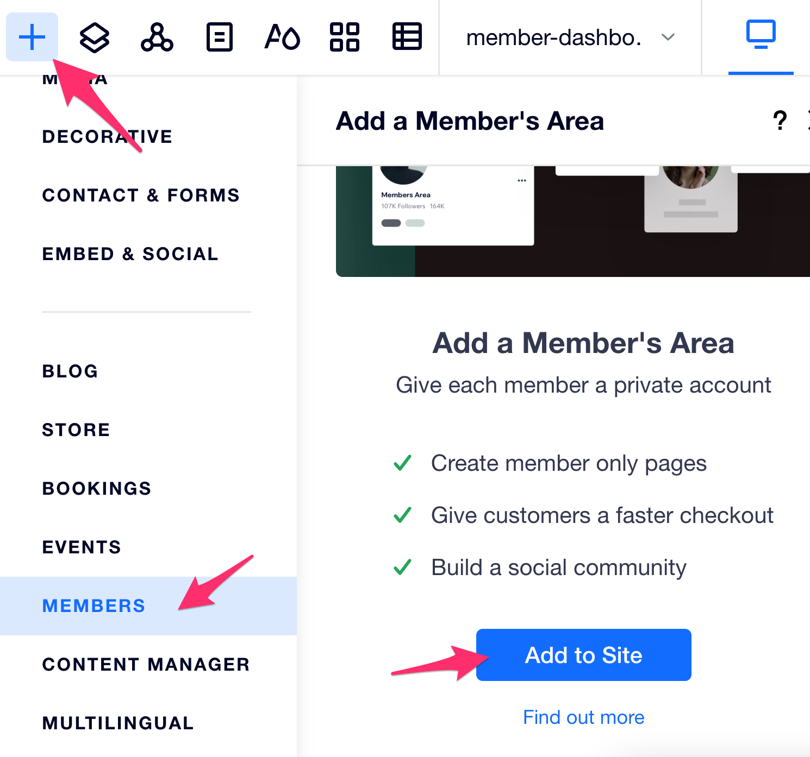


3. Add member dashboard page
    * Open the page manager

    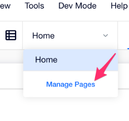

    * Add new page

    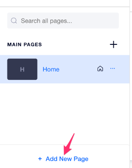

    * Pick blank page

    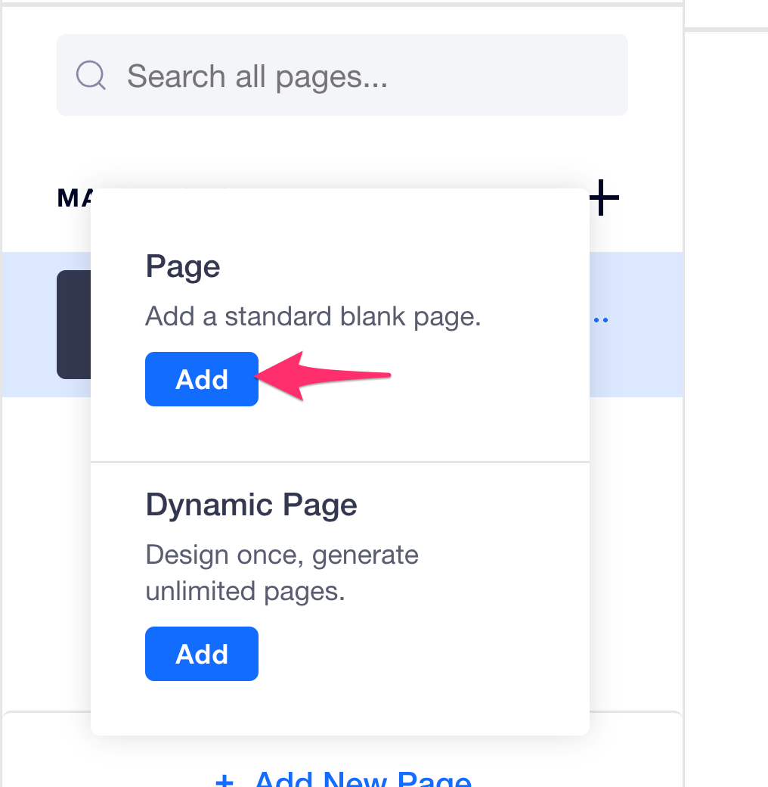

    * Name it "Member Dashboard"
    * Set the page to be available for members only under page settings

    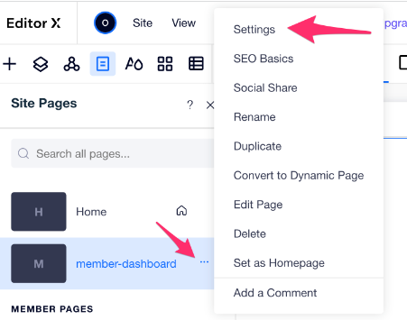
    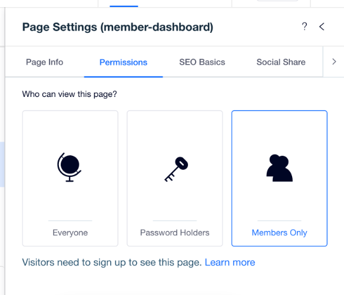

4. Drag the "site menu" component to the left and configure it to show all pages

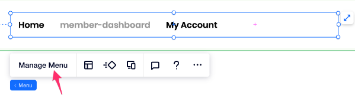
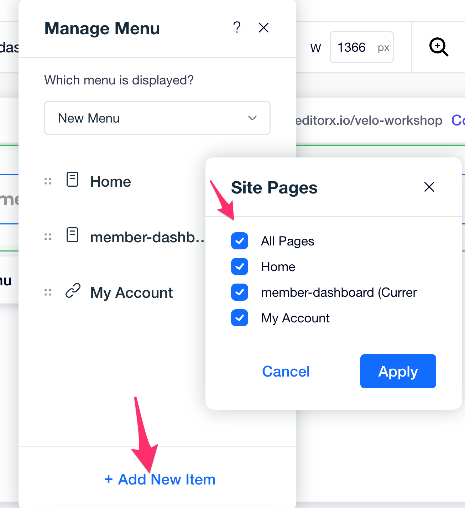

5. Turn on "Dev Mode"

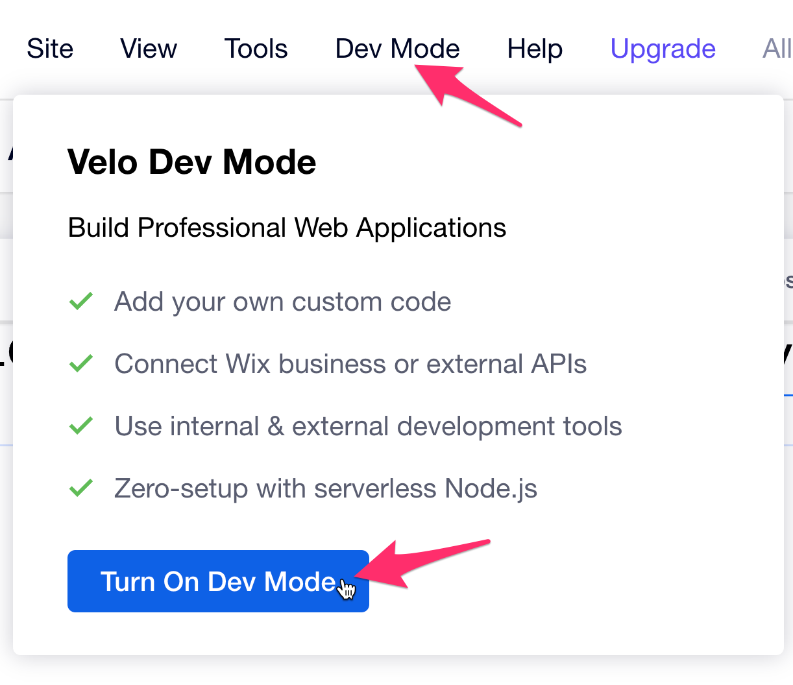

6. Create "services" collection
    * First we'll create a new collection and name it "services"

    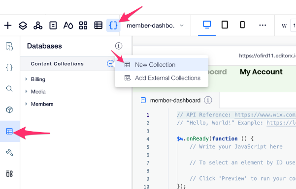

    * New collection comes with a "Title" field as the primary field. Add a new field named `Name`, make it primary field and delete the `Title` field.

    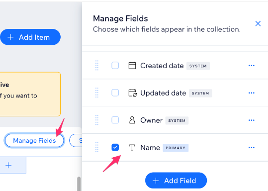

    * Let's change the permissions of the collection so only the site member who created the content can see and edit it.
        * open the collection permissions and privacy settings and follow the picture:

        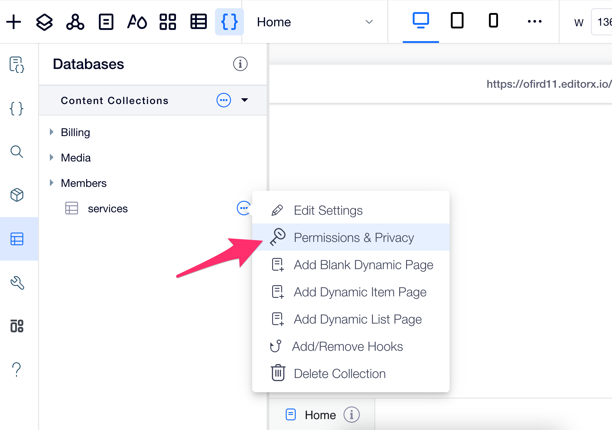
        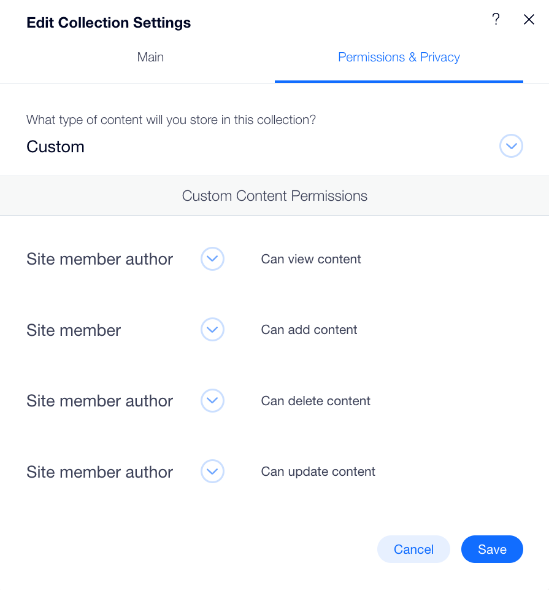

7. Adding UI (Make sure you're editing the "members dashboard" page)
    * Add a repeater to the stage and change its layout to "list"

    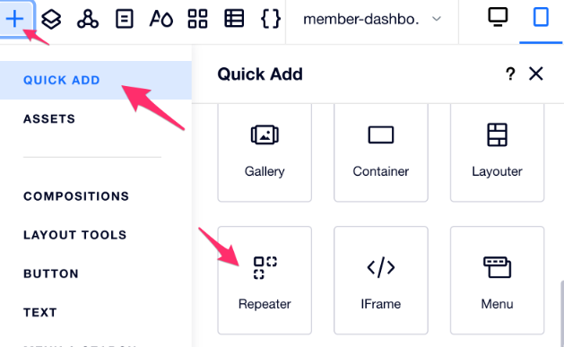
    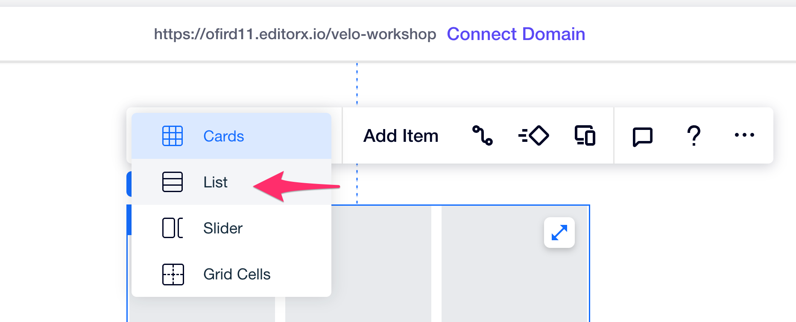

    * Drag a text component inside the repeater item
    * Add a title (text component) "My Services" above the repeater
    * Add a button "New" next to the title
    * By now your page should look like this:
    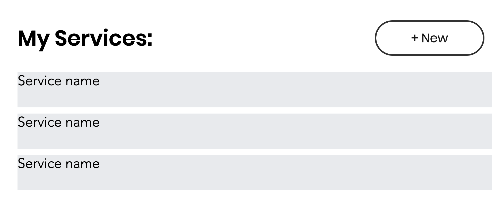

8. Bind the data
    * To bind the repeater item's text to our service name we will need to add to the page a "Dataset" component. Let's drag one to the stage

    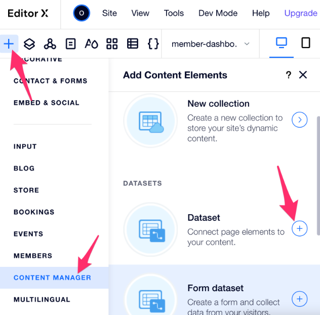

    * Set it to the "services" collection and configure it to allow both read & write

    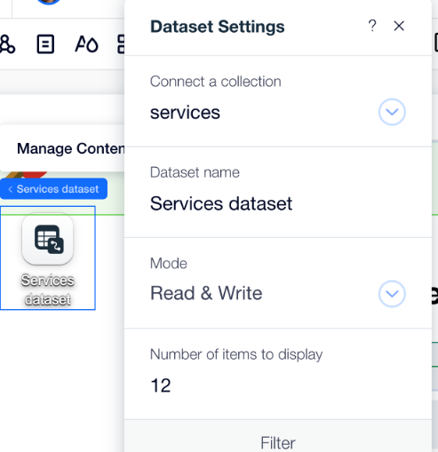

    * Now we can select the repeater and bind the text to the "Name" field in the dataset. Important to note that in the editor we won't see the actual data from the database.

    

9. Add new service

   * We'll add new services using a lightbox. First let's drag a new lightbox to the stage. Make sure to remove the default lightbox settings of displaying it automatically on every page.

   

   
   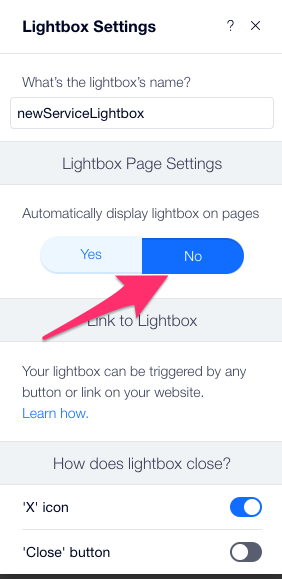

   * Add a **new dataset** into the lightbox. You can think of a dataset as a UI connector to a database. You can have multiple dataset connected to the same database. This dataset will be used to add new services. Set the dataset permissions to "Write only".
   * Delete the UI that comes with the preset and add a `Text Input` and a `Button`. Your light box should look similar to this one:
   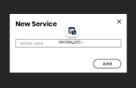
   * Bind the Text Input to the "Name" field and the "Add" button as a submit like we did for the repeater.

   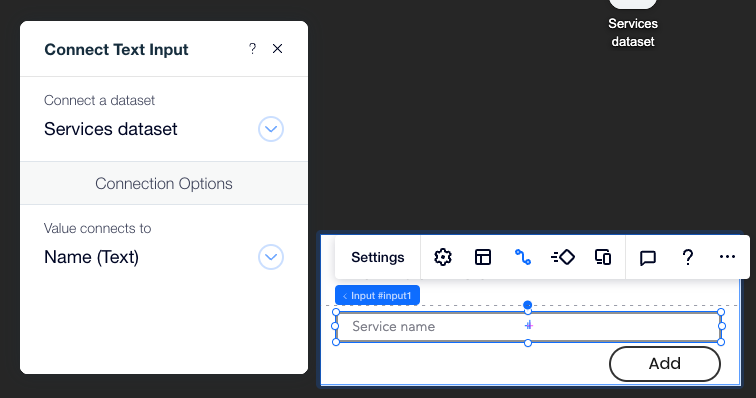
   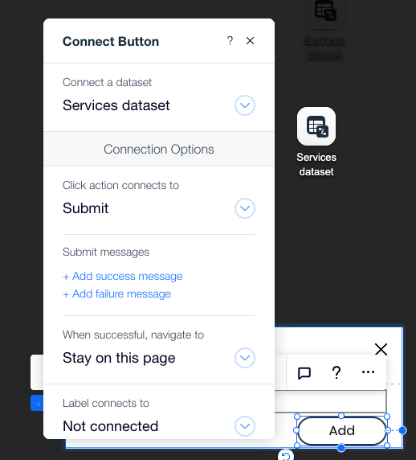

   * Now we need to connect the "New" button to open the lightbox. For that we'll write some code. Go to the page code editor and paste this code **instead** of the current content (Make sure to change the IDs to match your site)

    ```js
    import wixWindow from 'wix-window';

    $w.onReady(() => {
        $w('#addService').onClick(() => {
            wixWindow.openLightbox('newServiceLightbox')
                .then(() => {
                    $w('#servicesDataset').refresh();
                });
        })
    });
    ```
  
10. Test your work
    * If all the steps went as planed, people can now register to your site using their google/facebook/email accounts and see the list of their services. They can also create new services.
    * Bonus - For each row in the repeater add an icon of a trash bin and connect it to delete the current service.

## All Done?
Congratulations! You're done with Step 1 (the longest). Move on to [Step 2 - Learning about repeaters](step2.md)


