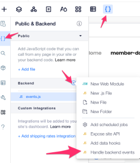
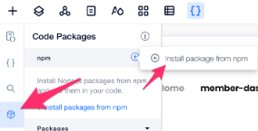

# Step 4 - Creating an API key using events

A best practice of SaSS services for developers is to give each developer an API key. This is how the developers identify themselves to the service. Important to note that this doesn't replace OAuth or other authentication methods.

For our service, we want the developer to identify with an API key that will be unique across their services. We want to assign a new API key for each developer (i.e site member). To do that we'll use the `onContactCreated` event.

* Add `events.js` in the backend and register to the CRM `onContactCreated` [event](https://www.wix.com/velo/reference/wix-crm-backend/events/oncontactcreated). 

* Generate a new API key (UUID) and save it into a new collection. In order to generate a UUID you should install the `uuid` npm package. Look for it in the "Code Packages" side menu item.

## Pro Tip
* Don't forget to set the right permissions to the new collection. In this case only Admin should have read/write access to the DB. When you want to read/write values to a DB from the backend you can elevate the permissions using the `suppressAuth` option. See `WixDataOptions` under wix-data [documentation](https://www.wix.com/velo/reference/wix-data)

## All Done :)

Let's go to [Step 5 - Exposing backend functionality via web methods](step5.md)

## Having Troubles?

Take a look at:
* `events.js` [file](https://gist.github.com/ofirdagan/d8d1f7aa0fcff3761812c73b63652885)
* `api-keys.dao.js` [file](https://gist.github.com/ofirdagan/8a2c1c4016eb2438a2652eec8bfbd2b1)
