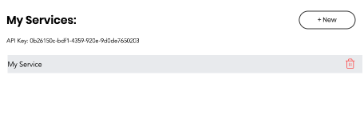

# Step 5 - Exposing backend functionality via web methods

So we've created a unique API key for each of our users. Now it's time to show it on the front end. We will expose a backend function that the client can call as if it was a regular async function without the hassle of issuing a network request. We call these functions [Web Modules](https://support.wix.com/en/article/velo-web-modules-calling-backend-code-from-the-frontend).

* Drag a text field to the stage.
* Create a new `.jsw` file and expose the API key of the user
* Call it from the front end and change the text of the text field.

## All Done?

If so your site should look similar to

Let's continue to [Step 6  - Monitoring a service and exposing REST API](step6.md)

## Having Troubles?

Take a look at:
* [members dashboard page code](https://gist.github.com/ofirdagan/b46b99413650cad3e7bdedaddc98c646) 
* `api-key.jsw` [file](https://gist.github.com/ofirdagan/fb29a4bc0131a975f465af09f2f0e599)

