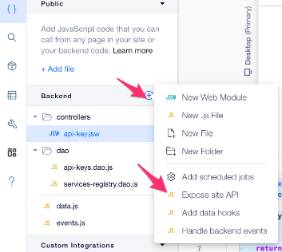

# Step 6  - Monitoring a service and exposing REST API

Wow your'e making a lot of progress! We're nearly done hang in there.

Up until now we mostly did the "boilerplate" of a regular john doe webapp. A user dashboard, some validations, domain objects CRUD etc. Now it's time for the real business logic. In order to monitor a service it will need to call our servers every X minutes (depending on our desired SLA). Becasue our services can be written anywhere and in any language we'll expose a REST endpoint to report "isAlive". To expose a REST endpoint we'll create a file named `http-functions.js` under the backend folder. Check out the docs [here](https://www.wix.com/velo/reference/wix-http-functions)

* Expose a `GET` endpoint which will get the service name as a path or a query param and the api key as a header named `x-api-key`. For now this endpoint should verify the api key and save the latest ping timestamp per service.
* Clone this repo and go to the `demo-app` folder.
    * run `npm install`
    * implement the `monitor` function in `monitor.ts`
    * fill in your `servicName` and `apiKey` in `index.ts`
    * test to see that everything works

# Having Troubles?

Take a look at:
* [http-functions.js](https://gist.github.com/ofirdagan/d700f23799b83acaf56c0de0c102922c)
* [services-pings.dao.js](https://gist.github.com/ofirdagan/ed9815edf61afa2c870551dd1c189453)
* [monitor.ts](https://gist.github.com/ofirdagan/f9ba9da6cea25f9905d68bcccf79e898)
